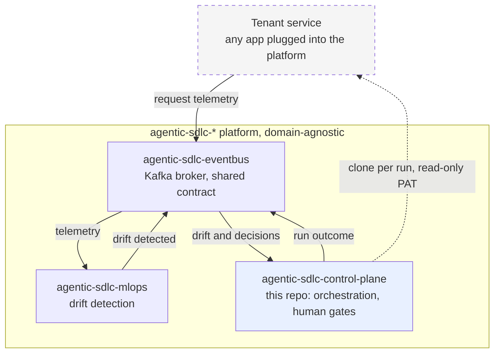
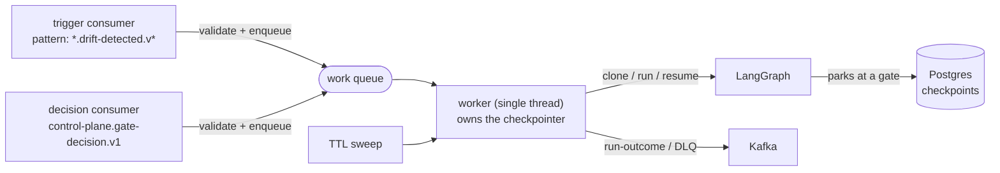
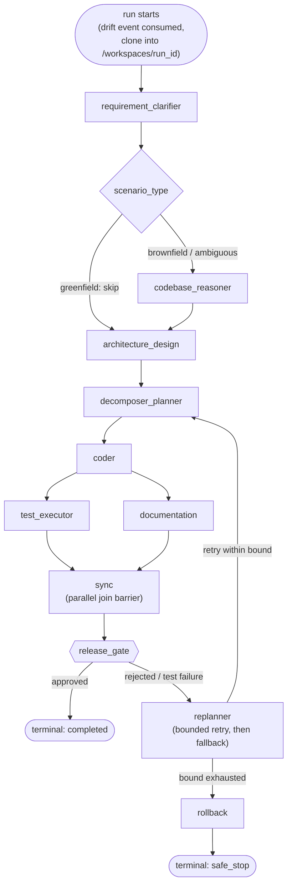
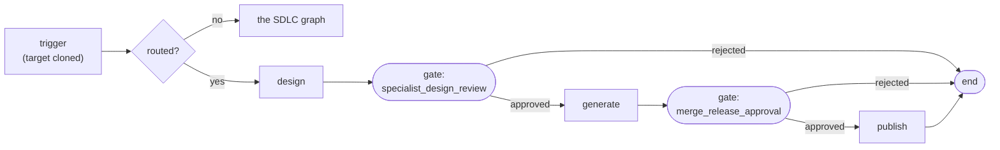

# agentic-sdlc-control-plane

LangGraph-based orchestrator for the `agentic-sdlc-*` platform. It consumes drift signals, clones
the repository of whichever service triggered the run, drives a governed multi-step
build/test/document workflow against that clone, and pauses at real human-in-the-loop gates before
continuing.

> **Designing or reviewing rather than running?** Start with
> [`docs/executive-summary.md`](docs/executive-summary.md) for a two-page orientation to the whole
> platform, then [`docs/system-design.md`](docs/system-design.md) for the authoritative design.
> This README covers how to run and use this service specifically.

> **Want to watch a complete governed run?** [Running the whole platform](#running-the-whole-platform)
> gives an OS-neutral command sequence that drives a drift signal through a clone, two human gates,
> a real pytest execution and a commit, to a `completed` outcome — in about 90 seconds, with no
> PowerShell and no credentials. The recorded result is in
> [Functional verification](#functional-verification).

> **Driving a real specialist run?** That is a different path — a pinned external CLI that designs,
> generates and differentially tests real code, with real model spend.
> [Driving a specialist run](#driving-a-specialist-run) has the command sequence and the traps,
> including the one that is not optional: publish is refused a pull request by the runtime PAT, so
> you open it by hand.

## Tech stack

- **Orchestration**: Python 3.12, LangGraph 1.2.9
- **State/validation**: Pydantic 2.10.4 (pinned by the shared `agentic-events` contract, not chosen
  independently)
- **Checkpointing**: langgraph-checkpoint-postgres 3.0.5 against its own `postgres:16-alpine`
- **Events**: kafka-python-ng 2.2.3, `agentic-events` (shared envelope contract)
- **Configuration**: PyYAML 6.0.3, for the specialist routing table
- **Testing**: pytest 8.3.4, pytest-cov 7.1.0

## Architecture



A tenant is any application plugged into the platform; nothing here depends on what one does — see
[`docs/adr/0001`](docs/adr/0001-keep-the-control-plane-domain-agnostic.md). Every solid arrow is a
Kafka topic; the dashed one is the only non-Kafka interaction, a read-only clone.

### Internal structure

Two Kafka consumers and one worker. Neither consumer ever executes a run:



A gate can park a run for as long as a human takes to answer, so a poll loop must never wait on
one — it would exceed `max.poll.interval.ms` and trigger a rebalance that takes every other
in-flight run on the partition with it. The poll loops therefore only validate and enqueue; the
worker executes. Parked state lives entirely in Postgres, so a run can be resumed by a different
process from the one that started it. See `docs/adr/0005`. That covers the graph's own state and,
since [ADR 0026](docs/adr/0026-a-runs-delivery-target-outlives-its-process.md), where the run's
change is delivered — which used to be held only in the starting process's memory, so a restart
left an approved change unpublished and reported the run `completed` anyway.

### The graph



Nine nodes plus two helpers (`sync`, `rollback`). Greenfield runs skip `codebase_reasoner`;
`test_executor` and `documentation` fan out in parallel and rejoin at `sync`.

### Gates

Five gate types exist in `GateType`, and which of them fire depends on `scenario_type`:
`clarification_approval` and `plan_approval` on greenfield, `codebase_impact_review` on brownfield,
`replanning_approval` when a re-planning conflict is detected, and `merge_release_approval` always.
Every gate that fires blocks, using a real LangGraph `interrupt()` backed by this repo's Postgres
checkpointer. A parked run resumes when a decision arrives on
`control-plane.gate-decision.v1`, correlated by `thread_id == run_id`.

Every run ends in exactly one reported terminal state — `completed`, `failed`, `safe_stop`,
`clone_failed`, or `stale` — published to `control-plane.run-outcome.v1`.

## Quickstart

Requires a running `agentic-sdlc-eventbus` broker.

```bash
cp secrets/postgres_password.txt.example secrets/postgres_password.txt
```

```bash
cp secrets/github_pat.txt.example secrets/github_pat.txt
```

Edit both: a password of your choosing, and a fine-grained read-only GitHub PAT with access to the
repositories this service will clone. The PAT is a runtime credential only — it is what
clone-per-run authenticates with. Nothing at build time needs it. Then:

```bash
docker compose up -d --build
```

```bash
docker logs -f agentic-sdlc-control-plane-consumer
```

Expect `Subscribed to pattern .*\.drift-detected\.v[0-9]+`. A newly created drift topic is
discovered within about 30 seconds, governed by `metadata.max.age.ms`.

### Running the whole platform

This service does something observable only when the rest of the platform is producing events.
[`scripts/demo-platform.ps1`](scripts/demo-platform.ps1) brings all four repositories up in
dependency order, waiting on a real readiness signal between stages rather than a fixed sleep —
container health, or a specific log line where a stage needs a readiness condition narrower than
"the worker is turning". Every container in the platform now reports health, the two consumer
services included — see [`docs/adr/0013`](docs/adr/0013-liveness-is-the-workers-signal-not-the-process.md).

It requires all four repositories checked out side by side. That is a prerequisite of the script
only: each repository still starts on its own, and no compose file references another.

```powershell
.\scripts\demo-platform.ps1 -Build
```

Drop `-Build` on subsequent runs. Add `-Demo` to drive one signal all the way through — real
traffic to the tenant service, a drift signal, a clone, a human gate, a decision, and the outcome
event read back off the broker:

```powershell
.\scripts\demo-platform.ps1 -Demo
```

`-Status` prints the state and health of every platform container; `-Down` stops everything.

Only the drift signal is injected. Genuine detection compares a trailing 7-day reference window
against the current hour, which no demo can populate. Everything after that point is the
production path: real pattern subscription, real clone, real `interrupt()`, real resume from
Postgres. The demo also mounts a synthetic fixture so the run reaches `completed` instead of
safe-stopping at the coder node — see [`docs/adr/0001`](docs/adr/0001-keep-the-control-plane-domain-agnostic.md)
for why the shipped image has none.

A cold start to `completed` takes roughly 90 seconds.

#### Driving a run without the script

The script above is a Windows convenience wrapper, not the only way in. Two repositories and four
commands are enough to see the whole governed path, on any OS with Docker. No credential is
required: the repository the run clones is public.

```bash
# 1. Broker, from the agentic-sdlc-eventbus checkout
docker compose up -d

# 2. Control plane, from this checkout, with the demo fixture mounted read-only
docker compose -f docker-compose.yml -f scripts/demo/compose.demo-fixtures.yml up -d
```

```bash
# 3. Trigger a run. RUN_ID must be unique per run - it becomes the LangGraph thread_id
#    that the gate decision below correlates on.
RUN_ID="demo-$(date +%s)"
REPO="https://github.com/jayakumard10/agentic-sdlc-eventbus.git"
kafka () { docker run --rm -i --network eventbus apache/kafka:4.1.2 "$@"; }

# event_id is a strict UUID on the envelope. Generated inside the consumer container
# rather than on the host, because no single host command covers Linux, macOS and Git
# Bash for Windows - `uuidgen` and /proc/sys/kernel/random/uuid are each missing on at
# least one of them. The container is already running by step 2.
uuid () { docker exec agentic-sdlc-control-plane-consumer python -c "import uuid;print(uuid.uuid4())"; }

envelope () {  # $1 = event_type, $2 = service, $3 = payload JSON
  printf '{"schema_version":"1.0","event_id":"%s","correlation_id":"%s","tenant":"default","service":"%s","event_type":"%s","timestamp":"%s","producer":{"service":"%s","instance_id":"manual"},"git_target":{"repo_url":"%s","branch":"main","commit_sha":null},"scenario_type":"brownfield","metrics":{},"payload":%s}\n' \
    "$(uuid)" "$RUN_ID" "$2" "$1" "$(date -u +%Y-%m-%dT%H:%M:%SZ)" "$2" "$REPO" "$3"
}

envelope drift-detected agentic-sdlc-mlops '{"sample_size":483}' \
  | kafka /opt/kafka/bin/kafka-console-producer.sh --bootstrap-server broker:19092 \
      --topic mlops.drift-detected.v1
```

The run clones the target, then parks at the first gate. Watch it with
`docker logs -f agentic-sdlc-control-plane-consumer`.

```bash
# 4. Answer each gate. A brownfield run fires two - codebase_impact_review, then
#    merge_release_approval - so send this twice, waiting for the park in between.
envelope gate-decision agentic-sdlc-control-plane \
  '{"gate_type":"any","decision":"approve","decided_by":"a-reviewer","comment":"Approved."}' \
  | kafka /opt/kafka/bin/kafka-console-producer.sh --bootstrap-server broker:19092 \
      --topic control-plane.gate-decision.v1
```

Read the outcome back off the broker, and check the audit trail is intact:

```bash
kafka /opt/kafka/bin/kafka-console-consumer.sh --bootstrap-server broker:19092 \
  --topic control-plane.run-outcome.v1 --from-beginning --max-messages 200 --timeout-ms 20000

docker exec agentic-sdlc-control-plane-consumer python -c \
  "from pathlib import Path; from agentic_control_plane.telemetry import verify_chain; \
   print(verify_chain(Path('/var/audit/runs.jsonl')))"
```

Verified on both Linux and Git Bash for Windows. One portability note, and it applies only to
**Git Bash for Windows**: export `MSYS_NO_PATHCONV=1` first, or `/opt/kafka/...` is rewritten into
a Windows path before it ever reaches the container, and the producer fails with
`exec: ... not found`. On Linux and macOS nothing extra is needed.

The `uuid` helper exists for the same class of reason. `event_id` is a strict `UUID` on the
envelope, and an empty or malformed one fails validation — the event is routed to the DLQ and the
parked run simply never resumes, which looks like a hang rather than a rejection.

### Driving a specialist run

The recipe above drives the **demo** path: a synthetic fixture, no specialist, no credentials. A
*specialist* run is a different thing — it invokes a pinned external CLI (`cobol-modernizer`) that
designs, generates and differentially tests real code, then delivers it to an output repository. It
costs real model spend and takes roughly 12 minutes end to end.

Everything below was used to drive run `step62-cbact04c-20260908-212245`, recorded in the
specialist's own [verification 25](https://github.com/jayakumar-devaraj/agentic-sdlc-cobol-modernizer/blob/main/docs/qa/verification/25-the-delivered-artifact-builds.md).

#### 1. Bring up the specialist-capable stack

**Both compose files, and `CLAUDE_SESSION_DIR`.** The overlay alone starts a consumer that exits on
`KAFKA_BOOTSTRAP_SERVERS must be set` — it is an override, not a second stack.

```bash
export CLAUDE_SESSION_DIR="$HOME/.claude"
docker compose -f docker-compose.yml -f docker-compose.specialist.yml up -d
```

The specialist version is baked into the image at build time from the pin in
`docker-compose.specialist.yml`, so a stack that was already up is running whatever it was built
with. **After changing the pin, rebuild — restarting is not enough.**

```bash
docker compose -f docker-compose.yml -f docker-compose.specialist.yml build consumer
docker exec agentic-sdlc-control-plane-consumer \
  python -c "import importlib.metadata as md; print(md.version('cobol-modernizer'))"
```

#### 2. Start the run

`RUN_ID` must be unique — it is the `correlation_id` and the LangGraph `thread_id`, and every gate
decision correlates on it.

```bash
RUN_ID="step63-cbact04c-$(date +%Y%m%d-%H%M%S)"
python scripts/publish_drift.py "$RUN_ID"
```

**Check the exit code, not the absence of a traceback.** A host-side publish to this broker
intermittently times out — roughly three in eight — so the script asserts the topic's end offset
moved by exactly one and exits non-zero otherwise. On `DID NOT LAND`, run it again.

Watch with `docker logs -f agentic-sdlc-control-plane-consumer`. The Kafka client is chatty;
filtering out `kafka.(conn|coordinator|consumer|cluster|protocol)` leaves the run's own lines.
Beware of waiting on the word *gate* alone: the consumer logs its **subscription** to
`control-plane.gate-decision.v1` at startup, which matches and reads like a park that has not
happened yet.

#### 3. Answer the two gates

A specialist run parks twice, and the gate names are not free text:

```bash
python scripts/publish_gate.py "$RUN_ID" specialist_design_review approve "..."
# ... wait for the second park ...
python scripts/publish_gate.py "$RUN_ID" merge_release_approval approve "..."
```

**Pre-flight the design before approving the first gate.** The design is the cheapest thing to
reject, and rendering it offline takes seconds against a generate phase of several minutes:

```bash
docker cp "agentic-sdlc-control-plane-consumer:/workspaces/$RUN_ID/.specialist-design/design.json" ./design.json
```

Render it with the specialist's own `run_generate` and a scripted author. A `wiring: rendered`
verdict with `skipped_steps=[]` means the generate phase will wire every step. On **Git Bash for
Windows**, the destination of a `docker cp` out of the container must be an absolute path in
drive-letter form (`<drive>:/<dir>/design.json`) even with `MSYS_NO_PATHCONV=1`; given a POSIX-style
path it silently prefixes the drive and writes somewhere nested that nothing then finds.

The second gate carries the differential verdict. `mismatched` is not automatically a defect —
`CBACT04C`'s three account-break fields are a documented-correct divergence, and three independent
designs have produced exactly them.

#### 4. Open the pull request by hand

Approving `merge_release_approval` commits, pushes, and then **fails to open the pull request**:

```
INFO  publish: pushed to agentic-patch/<run_id>
ERROR publish: could not open a pull request: GitHub returned 403
      {"message":"Resource not accessible by personal access token"}
```

The runtime PAT has no `pull_requests: write`. The repo-level `permissions` probe does **not** cover
that grant, so a token reporting `admin/maintain/pull/push/triage` still cannot do this. The run
still reaches `completed`; only the PR is missing.

```bash
gh pr create --repo <owner>/<output-repo> --base main --head "agentic-patch/$RUN_ID" ...
```

**Do not widen the token to fix this.** The control plane opening pull requests and writing CI would
mean CI running model-generated code with the output repository's secrets — the reason CI belongs to
the output repository's default branch at all. Opening it by hand keeps a person on that step, and
the delivered branch's own `verify` still runs: for `pull_request`, the workflow is resolved from the
base branch, so a delivered branch needs no workflow of its own.

## Local development

```bash
python -m venv .venv && .venv/bin/pip install -r requirements.txt
```

Run against the compose Postgres with the broker reachable on the host:

```bash
POSTGRES_HOST=localhost POSTGRES_PORT=5433 KAFKA_BOOTSTRAP_SERVERS=localhost:9092 python -m agentic_control_plane.main
```

Configuration:

| Variable | Default | Purpose |
|---|---|---|
| `KAFKA_BOOTSTRAP_SERVERS` | *(required)* | Event bus. Use port 9093 from another container, 9092 from the host. |
| `POSTGRES_HOST` / `PORT` / `DB` / `USER` | `postgres` / `5432` / `control_plane` / `control_plane` | Checkpoint store |
| `POSTGRES_PASSWORD_FILE` | — | Path to the password file. `POSTGRES_PASSWORD` also works but is visible in `docker inspect`. |
| `GIT_PAT_FILE` | — | Path to the PAT used to clone target repositories |
| `WORKSPACES_ROOT` | `/workspaces` | Where per-run clones live |
| `FIXTURES_DIR` | `/fixtures` | Replay-mode fixtures. Empty unless you mount your own — see below. |
| `SPECIALIST_ROUTING_FILE` | `config/scenario_specialists.yaml` | Which generator handles which target, and with what model — see below |
| `SPECIALIST_OUTPUT_ROOT` | `/specialist-output` | Where a routed specialist writes. A separate mount from `WORKSPACES_ROOT` on purpose — reconciliation sweeps that root |
| `ORCHESTRATOR_MODE` | `replay` | `live` requires a `claude` CLI this image does not install |
| `CLAUDE_SESSION_DIR` | *(required by the specialist override)* | Host directory holding a copy of the `claude` CLI's `.credentials.json`, mounted read-write at `/root/.claude`. No default, deliberately — see [ADR 0022](docs/adr/0022-a-specialist-capable-deployment-is-an-override-and-three-grants.md) |
| `TESTCONTAINERS_HOST_OVERRIDE` | *(unset)* | `host.docker.internal` when Testcontainers runs inside a container against the host's daemon. Set by the specialist override; unverified by any run |
| `PUBLISH_MODE` | `none` | `none` / `branch` / `pull_request`. What happens to an approved change. Anything but `none` needs a **write-scoped** PAT — see [ADR 0012](docs/adr/0012-an-approved-change-must-outlive-the-run-that-made-it.md) |
| `PARKED_RUN_TTL_HOURS` | `24` | After this, a parked run is reported `stale` and cleaned up |
| `REPLANNING_CONFLICT_MARKERS` | *(empty)* | Comma-separated module names that count as an existing-functionality conflict |
| `AUDIT_LOG_PATH` | `/var/audit/runs.jsonl` | Hash-chained audit trail of every node execution and gate decision. Verify with `verify_chain`. |

### What happens to an approved change

A completed run's commit is delivered before its workspace is reclaimed — that window is the only
point at which it still exists on disk.

| `PUBLISH_MODE` | Behaviour |
|---|---|
| `none` *(default)* | Commit and report. Governance without delivery, and the PAT stays read-only |
| `branch` | Push `agentic-patch/{run_id}`. Works against any git host |
| `pull_request` | Push, then open a request against **the branch the run cloned**. GitHub only; elsewhere the branch still lands and the reason is reported |

The push names `HEAD:refs/heads/agentic-patch/{run_id}` explicitly, so nothing here can write to the
branch the run cloned. The outcome event carries `commit_sha_after`, `published`, the branch, a
`pull_request_url` where there is one, and `publish_error` where delivery failed.

A delivery failure does not fail the run — the change was generated, tested and approved either way
— but it is reported on the outcome event, because a failed push means the change was discarded.
See [ADR 0012](docs/adr/0012-an-approved-change-must-outlive-the-run-that-made-it.md).

### Specialist and model routing

Which generator produces code for a run, and with what model, comes from
`config/scenario_specialists.yaml` rather than from the package. That file is the only place a
tenant service is named at runtime; the resolver that reads it knows nothing about what is in it,
which is what keeps the package domain-agnostic
([ADR 0016](docs/adr/0016-specialist-and-model-routing-lives-in-configuration.md)).

```yaml
version: 1
specialists:
  default:                      # required, and must be `builtin`
    kind: builtin
    model: claude-sonnet-5
    cli_timeout_seconds: 480
  some-specialist:
    kind: external              # a separately released tool, invoked as a subprocess
    command: some-specialist
    phases:
      plan:
        args: [plan]
        requires:
          executables: [claude]
routes:
  - scenario: a-label-for-the-audit-trail
    repository: some-tenant-service
    specialist: some-specialist
```

Routes match **the repository the run's workspace was cloned from** — the last path segment of its
`origin` remote, minus any `.git`, case-insensitively. A target with no matching route, and a
workspace with no remote at all, take `default`. Delete the file, or mount an empty path over it,
and every run takes `default` with the values above.

An external specialist's `requires` list is checked before anything is invoked, and what is absent
is reported by name. This image is `python:3.12-slim` and carries no specialist runtime, so a
specialist-capable deployment is a customised image rather than a config setting — the same posture
live mode already has for the `claude` CLI.

**A routed run does not enter the graph described below.** The decision is made when the run is
created, immediately after its target is cloned, and a routed run executes its own graph instead:



Two gates, guarding different things. The first asks about a design — something a reviewer can
read — before the expensive phase runs. The second guards a repository, and **nothing is committed
until it approves**, which is why this graph has no rollback: a generate that fails half-way leaves
an untouched checkout, and a run nobody approves leaves the target project as it found it
([ADR 0021](docs/adr/0021-nothing-commits-before-the-release-gate.md)).

Routing before the graph rather than inside it is deliberate: the SDLC graph's own first nodes
gate a brownfield run on a codebase-impact analysis, which is not a decision a reviewer can
usefully make about a run whose code an external tool will write. See
[ADR 0019](docs/adr/0019-a-specialist-run-is-its-own-graph.md) and
[ADR 0020](docs/adr/0020-a-run-is-routed-to-its-graph-before-it-starts.md).

A route names the project generated code is written into — a *different* repository from the one
it reads, which stays read-only for the whole run. A route without one still runs and publishes
nothing, which is the default: publishing to a repository nobody named is the one mistake here that
cannot be undone by deleting a directory.

Delivery follows `PUBLISH_MODE` exactly as it does for an SDLC run, and defaults to `none` for the
same reason — the change is committed in the run's own checkout and reported, never pushed. Pushing
also needs a **write-scoped** `GIT_PAT_FILE` when the target project is private.

### Code generation modes

Neither generation mode works out of the box, by design rather than omission:

- **Replay** needs fixtures, which are recordings of work on one specific service. A domain-agnostic
  platform cannot ship them, so `FIXTURES_DIR` is an empty mount point. Mount fixtures shaped as
  `{scenario_type}/transcript.json` to enable it.
- **Live** needs the `claude` CLI on `PATH` and an authenticated session, neither of which this
  image provides. It is an opt-in built on a customised image.

Without either, a run reaches the coder node and safe-stops with a stated reason, ending in a
defined terminal state with outcome telemetry. See `docs/adr/0001`.

Live mode has been exercised for real, not just reasoned about: running the worker on a host that
has the CLI (rather than in the shipped image) drove a full brownfield run in which the coder node
invoked `claude` and generated two files in 112 s, `test_executor` ran a real pytest against them,
and the release gate committed the result — see [Functional verification](#functional-verification).
That is the same code path a customised image would take; only the location of the CLI differs.

## Testing

```bash
pytest
```

**443 tests. 94% statement coverage in CI**, where a Postgres service container is attached
and nothing skips; 91% locally without one. CI enforces a floor of 93%
(`--cov-fail-under=93`), so coverage can only ratchet upward - and because skipping the
durability tests drops it to 91%, a CI run whose Postgres service container never came up
fails there rather than passing quietly.

Tests live in four tiers, and the tier is the directory:

| Tier | Tests | Needs | Holds |
|---|---|---|---|
| `tests/unit/` | 262 | nothing running | the package's logic in isolation |
| `tests/contract/` | 106 | nothing running | shapes a consumer depends on - the outcome-event envelope, the routing table, and this repository's own layout |
| `tests/integration/` | 15 | a real Postgres | the durable inbox and run-target stores |
| `tests/evaluation/` | 60 | a real Postgres | the seam, driven from the real calling position: the compiled graph, the specialist invocation, gate interrupt and resume |

Select a tier with its marker:

```bash
pytest -m unit          # fast, nothing to start
pytest -m "integration or evaluation"
```

**Nothing writes those markers by hand.** `tests/conftest.py` derives each one from the
directory the test is in, and raises a collection error for any test file outside the four
tiers. A marker a contributor has to remember is a marker a contributor forgets, and a test
with no tier marker is collected, counted in "passed", and never actually run by a
marker-filtered command. `--strict-markers` does not catch that - it catches a *misspelled*
marker, not a missing one.

### Running the tests that need Postgres

22 tests skip without a reachable database. Run them against the compose Postgres, passing
the same secret file Compose gives it - the password default in `_postgres_conn_string` is
`control_plane`, which is deliberately not the password you were told to choose in
Quickstart, so omitting it authenticates as the wrong user and every one of these skips
rather than fails:

```bash
POSTGRES_HOST=localhost POSTGRES_PORT=5433 POSTGRES_USER=control_plane POSTGRES_DB=control_plane   POSTGRES_PASSWORD_FILE=secrets/postgres_password.txt   pytest --cov=agentic_control_plane --cov-report=term-missing
```

`443 passed` with no skips is the whole suite. A run reporting skips has not exercised
durability.

**Five of those 22 sit in `tests/unit/`, which is a known and bounded exception**, not an
oversight: four in `test_consumer.py` and one in `test_runner.py`. They are Postgres-gated
tests inside modules that are otherwise pure unit tests, and separating them means splitting
files rather than moving them - which is a change to what the tests do, not to where they
live. `tests/contract/test_repository_structure.py` pins the count at five so the exception
cannot quietly grow.

Coverage gaps are concentrated in code that needs live infrastructure to exercise
meaningfully: real `KafkaProducer`/`KafkaConsumer` construction (`events.py`, `main.py`) and
the live `claude` CLI paths (`coder.py`). Those are covered by functional verification
instead.

### Functional verification

Unit tests measure whether the code does what it says in isolation. They do not measure
whether a gate survives a container restart, whether a rebalanced consumer resumes a parked
run, or whether a clone authenticates - and this service's failures live there.

That evidence is the evaluation tier's own artefact:
**[`tests/evaluation/REPORT.md`](tests/evaluation/REPORT.md)** - end-to-end runs against a
real broker and a real Postgres, including the five defects a fully green unit suite passed
straight through.

## Deployment / CI

`.github/workflows/ci.yml` runs on **pull requests to `main`, and on manual dispatch - not
on push**. GitHub checks a pull request against the merge result, so the tree that lands on
`main` is the tree the PR already tested; re-running on the merge commit paid twice for one
answer. Use `workflow_dispatch` to run it against `main` by hand when that is actually wanted.

Before installing anything it asserts `requirements.lock` still agrees with
`requirements.txt`, which is stdlib-only and fails in seconds. After installing it asserts
the four test tiers partition the suite - that the marker-filtered collection count equals
the unfiltered one - so a test belonging to no tier fails the build instead of being
invisible to every marker-selected run.

`.github/workflows/security.yml` is separate and runs **weekly on a schedule**, not per pull
request: it runs `pip-audit` over the installed dependency tree, because a CVE is published
on the world's timetable rather than on this repository's. It reports no status on a pull
request, so its check must never be made a required one - a required context that nothing
reports blocks every PR forever. The file records what it deliberately does not do, and why.

The test job runs the suite against a real `postgres:16-alpine` service container rather than
skipping the durability tests — those tests are the reason a durable checkpointer was chosen over
an in-memory one, so skipping them would leave the property that matters unverified. It also
asserts that no tenant-specific vocabulary has entered the package or its tests.

The compose job builds the image and asserts no credential persisted into it, by reading
`/root/.gitconfig`'s size. No build step writes one today, so that check passes trivially — it is
kept as a regression guard, because this is the image that handles a real PAT at runtime. It does
not run the consumer: this repo is independently clonable with no sibling checkout, so there is no
broker in CI to point it at.

The specialist-image job builds both images and checks them against each other. It asserts the
**default** image carries no `java`, `mvn` or `claude` — that one matters more than its opposite,
because if a future change moves the JDK into the default `Dockerfile` everything downstream still
passes and the decision is silently gone. It then asserts the specialist image reports the *pinned*
versions rather than merely having the tools, and reports both image sizes without gating on them.

No job needs a repository secret. `agentic-events` resolves anonymously while `agentic-sdlc-eventbus`
is public and through the optional `EVENTBUS_READ_PAT` when it is not
([ADR 0015](docs/adr/0015-the-build-works-whether-the-contract-repo-is-public-or-private.md)), and
CI never performs a real clone.

### Running a specialist

`Dockerfile.specialist` builds a second image on top of the default one, adding what an external
specialist needs: a pinned JDK, a matching Maven, and the `claude` CLI. The default image
deliberately carries none of it — most runs resolve to the built-in generator, and a specialist-
capable deployment is a customised image rather than a setting
([ADR 0017](docs/adr/0017-a-specialist-capable-image-is-a-second-image.md)).

Build both through compose, in this order — `Dockerfile.specialist` starts `FROM` the default image,
and `SPECIALIST_REQUIREMENT` comes from the override rather than being typed:

```bash
docker compose build consumer
CLAUDE_SESSION_DIR=/tmp/placeholder docker compose -f docker-compose.yml -f docker-compose.specialist.yml build consumer
```

`CLAUDE_SESSION_DIR` is a placeholder here on purpose: nothing is mounted during a build, but the
override requires the variable (see below), and compose interpolates the whole file before it
decides which part of it to act on.

**Use compose rather than a bare `docker build`, and this is not a style preference.** Both
Dockerfiles install `agentic-events` from `agentic-sdlc-eventbus`, which is private; resolving it
needs the `github_pat` BuildKit secret that `docker-compose.yml` declares and a bare `docker build`
does not pass. Without it the build fails inside `pip install` with `could not read Username for
'https://github.com'` — a git error several frames below the thing that is actually wrong. To build
by hand, pass it: `--secret id=github_pat,src=secrets/github_pat.txt` (ADR 0015).

Omit `SPECIALIST_REQUIREMENT` to build the runtime without any specialist installed, which is what
CI does — a green build should not depend on another repository's tag resolving. **A build that
omits it succeeds**, printing one line to stderr, and produces an image whose preflight passes and
whose specialist is absent: `require_runtime` checks the executables a phase declares, and the
specialist's own entrypoint is not among them.

**Two things the image cannot provide.** `claude -p` needs an authenticated session, which is
per-operator and is mounted at runtime, so the preflight passing means the CLI is on `PATH` and not
that a call will succeed. And the generating phase needs a Docker daemon, which this image does not
run — mount the host's socket, understanding that doing so is effectively granting root on the
host. Both are covered in ADR 0017.

### Deploying a specialist-capable consumer

`docker-compose.specialist.yml` overrides the `consumer` service with the image above and the four
things a specialist run needs that the default deployment does not have
([ADR 0022](docs/adr/0022-a-specialist-capable-deployment-is-an-override-and-three-grants.md)):

```bash
CLAUDE_SESSION_DIR=/path/to/a/claude-session docker compose -f docker-compose.yml -f docker-compose.specialist.yml up -d
```

The base file is unchanged by this — it keeps the default image and `PUBLISH_MODE: none`, so an
ordinary deployment never carries the socket mount or the write-scoped credential. Two of the four
are in the override (`PUBLISH_MODE: branch`, the Docker socket) and two are operator-held:

- **`secrets/github_pat.txt` must be write-scoped**, and needs three grants rather than one:
  `contents: read` on the specialist's own repository, because the image installs the wheel from it
  at build time; `contents: read and write` on whatever `output_repository` the routing table names;
  and whatever the event-bus contract build already required.
- **`CLAUDE_SESSION_DIR` is required and has no default.** Point it at a directory holding a copy of
  the CLI's `.credentials.json` and nothing else. The mount is read-write, and the container runs
  generated code — defaulting it at a live `~/.claude` is the reason there is no default.

Build both images first, in the order given above.
